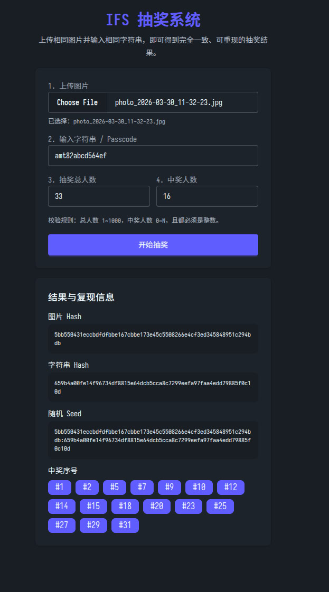

# [IFS 抽奖系统](https://szres.github.io/ifs-gacha-system/)

一个为 **Ingress First Saturday** 活动设计的可复现抽奖系统。



用户只需要：

- 上传一张图片（例如 IFS 活动合照）
- 输入一个字符串（例如当场公布的 passcode）

系统就会基于这两个输入生成一个固定的随机种子，并据此产出**可重复、可校验**的抽奖结果。

## 这套系统适合做什么？

在 IFS 活动中，抽奖最重要的往往不是“随机”，而是：

- **公开透明**：参与者能知道抽奖依据是什么
- **可以复核**：别人之后还能重新验证结果
- **结果稳定**：相同输入一定得到相同结果

本系统正是为这个场景设计：

- 相同图片 + 相同字符串 = 相同抽奖结果
- 任一输入变化，抽奖结果也会变化
- 同一次抽奖中，中奖者**不会重复**

## 功能特点

- 使用图片内容计算 **SHA-256 Hash**
- 使用输入字符串计算 **SHA-256 Hash**
- 将两者组合为固定 **Seed**
- 基于 Seed 进行伪随机抽奖
- 支持最多 **1000 人**参与
- 中奖序号不会重复
- 页面直接展示复现所需信息：
  - 图片 Hash
  - 字符串 Hash
  - Seed
  - 中奖序号

## 使用方法

### 1. 上传图片

上传一张用于本次抽奖的图片。

建议使用：

- IFS 活动合照
- 当天现场拍摄的照片
- 活动结束后统一公开的图片

只要图片文件内容完全一致，计算出的图片 Hash 就会一致。

### 2. 输入字符串 / Passcode

输入一个本次抽奖使用的字符串，例如：

- 当场公布的 passcode
- 活动主持人公开的固定口令
- 约定好的校验文本

### 3. 输入抽奖人数

- **抽奖总人数**：参与抽奖的人数
- **中奖人数**：本轮需要抽出的中奖人数

### 4. 点击“开始抽奖”

系统会自动：

1. 计算图片 Hash
2. 计算字符串 Hash
3. 组合成固定 Seed
4. 根据 Seed 抽出中奖序号

### 5. 查看结果

页面会展示：

- 图片 Hash
- 字符串 Hash
- 随机 Seed
- 中奖序号列表

这些信息可以用于现场公示，方便其他人复核。

## 如何校验抽奖结果

如果要验证某次抽奖是否可信，只需要重新输入完全相同的信息：

- 同一张图片文件
- 同一个字符串
- 相同的总人数
- 相同的中奖人数

只要输入完全一致，系统就应产生：

- 相同的图片 Hash
- 相同的字符串 Hash
- 相同的 Seed
- 相同的中奖序号

如果其中任意一项输入发生变化，结果也会随之变化。

## 输入规则与限制

- 抽奖总人数必须是 **1 ~ 1000** 之间的整数
- 中奖人数必须是 **大于等于 0** 的整数
- 中奖人数不能大于总人数
- 同一次抽奖中，中奖者不会重复
- 当中奖人数为 **0** 时，系统不会返回中奖序号

## 抽奖结果说明

系统返回的是**中奖序号**，例如：`#3`、`#17`、`#52`。

这意味着你需要在活动组织时，提前约定好参与者与序号之间的对应关系，例如：

- 报名顺序
- 签到顺序
- 现场编号

这样才能把抽出的中奖序号对应到具体参与者。

## 推荐使用流程

为了让抽奖更公开透明，建议在现场按以下流程操作：

1. 先公开本次使用的图片
2. 再公开 passcode / 字符串
3. 说明总人数与中奖人数
4. 现场执行抽奖
5. 公布图片 Hash、字符串 Hash、Seed 与中奖序号
6. 如有需要，让其他人用相同输入自行复现结果

## 本地运行

如果你想在本地启动这个页面：

```bash
npm install
npm run dev
```

启动后在浏览器打开本地开发地址即可使用。

## 适用范围说明

本项目适合作为：

- IFS 活动抽奖工具
- 小型活动的公开可复现抽奖页面
- 需要“可验证随机性”的简单抽奖场景

